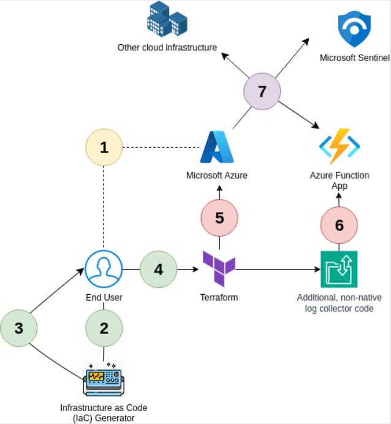
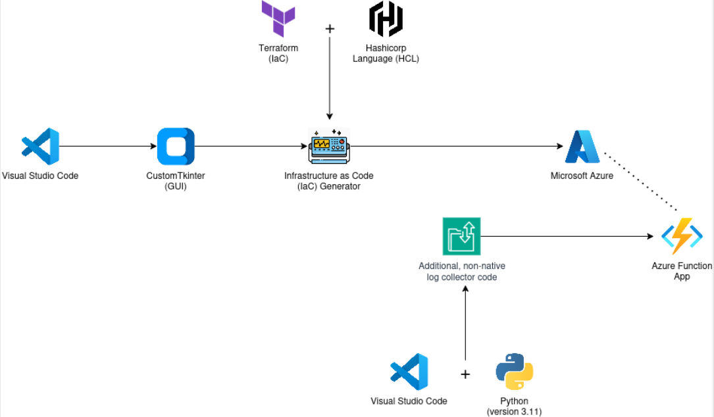
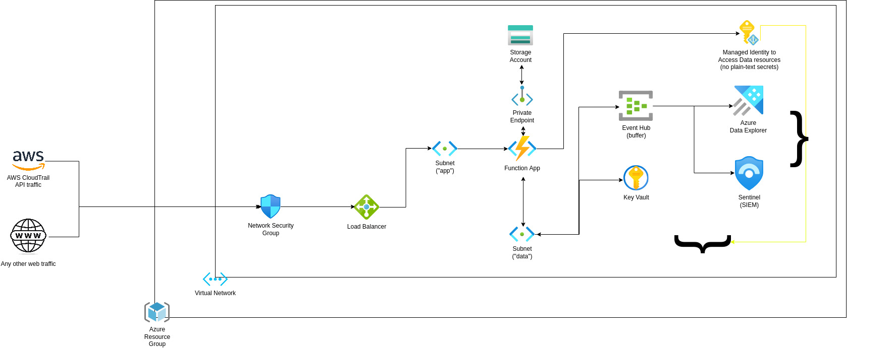

# 🛠️ IaC Generator v1 – SIEM Infrastructure (GUI)

## 📘 Overview

This project is a **Graphical User Interface (GUI)-based Infrastructure as Code (IaC) Generator** designed to simplify the deployment of a **Security Information and Event Management (SIEM) architecture**.

It enables users to:
- Generate ready-to-deploy Terraform configurations
- Deploy secure, scalable Azure infrastructure
- Integrate AWS CloudTrail logs into Azure for cross-cloud monitoring
- Avoid manual configuration complexity

The tool is built using **Python + CustomTkinter**, providing a clean and user-friendly interface for configuring infrastructure without needing deep Terraform knowledge.

---

## 🧠 What This Project Does

This application automates the creation of a **complete SIEM pipeline**, including:

- Azure networking and security components  
- Microsoft Sentinel integration  
- Azure Data Explorer (ADX) for analytics  
- Event Hub for log ingestion  
- AWS CloudTrail ingestion pipeline via Azure Function  
- Secure credential handling using Azure Key Vault  

It demonstrates:
- Infrastructure automation  
- Cloud security architecture  
- Cross-cloud integration (AWS → Azure) log collection

---

## 🧰 Prerequisites

Before running the application, ensure you have the following installed:

- Python 3.x  
- pip (Python package manager)  
- Azure CLI  
- Terraform  

---

## 🧰 Installation (Linux - Debian/Ubuntu)

### 🐍 Install Python & pip

```
sudo apt update
sudo apt install -y python3 python3-pip
```

---

### 🎨 Install GUI Dependency (CustomTkinter)

```
pip3 install customtkinter
```

---

### ☁️ Install Azure CLI

```
curl -sL https://aka.ms/InstallAzureCLIDeb | sudo bash
```

Login to Azure:
```
az login --use-device-code
```

---

### 🏗️ Install Terraform

```
sudo apt update && sudo apt install -y gnupg software-properties-common curl

curl -fsSL https://apt.releases.hashicorp.com/gpg | sudo apt-key add -

sudo apt-add-repository "deb https://apt.releases.hashicorp.com $(lsb_release -cs) main"

sudo apt update
sudo apt install -y terraform
```
---

## 🖼️ Diagrams

### Use Case Diagram


### Architecture Diagram


### Infrastructure Architecture


---

## 🚀 How to Run the Application

### 1. Clone the Repository

```
git clone https://github.com/your-repo/IaCGeneratorV1.git
```

### 2. Navigate into the Project Directory

```
cd IaCGeneratorV1
```

### 3. Run the Application

```
python3 main.py
```

---

## ⚙️ Usage

1. Open the GUI  
2. Enter required configuration values (Azure + AWS inputs)  
3. Click **"Generate Terraform"**  
4. Terraform files will be created in the `/code` directory  

### Deploy Infrastructure

```
az login --use-device-code
terraform init
terraform apply
```

---

## 🔐 Licensing

This project is licensed under the **GNU General Public License v3.0 (GPL-3.0)**.

You are free to:
- Use
- Modify
- Distribute  

However:
- Any distributed modifications **must also be licensed under GPL**

See the `LICENSE` file for full details.

---

## 📬 Contact

Project Showcase: https://showcase.itcarlow.ie/C00286043/index.html

**Szymon Kawecki**  
Student ID: C00286043  
South East Technological University  
📧 c00286043@setu.ie  

---

## 📌 Notes

- All steps and more information can be found in the **"Information"** tab within the GUI.

- This project is intended for **educational and demonstration purposes**.
- Due to limitations when testing with **Azure's Student Subscription**; the generated IaC may not be proprely linked however all required resources are created and can be linked manually using the Azure Portal.
- Ensure proper cloud permissions and billing awareness before deployment.
- Always review Terraform plans before applying changes.
